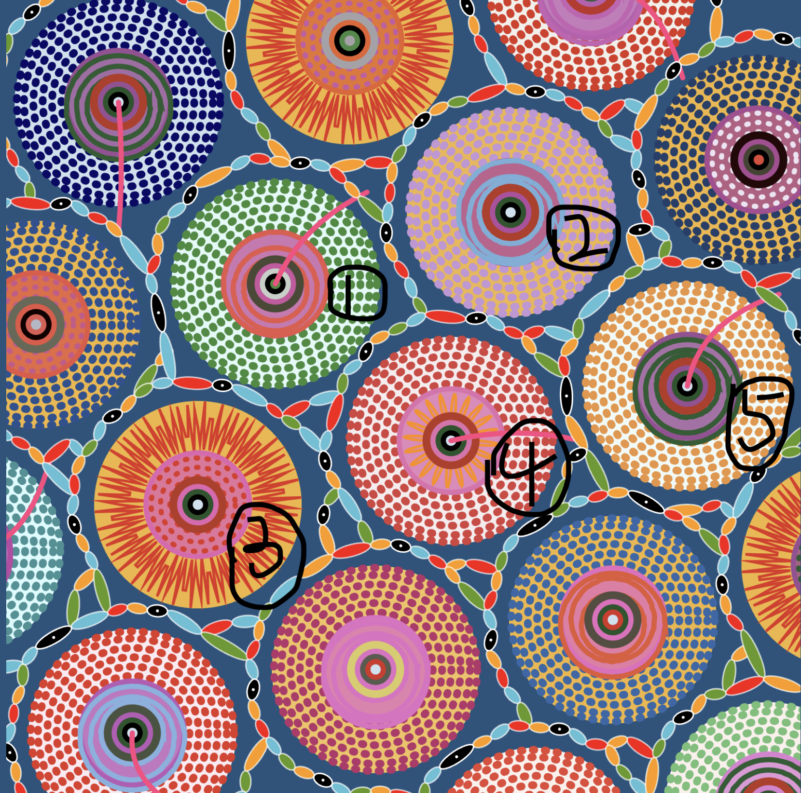

# Audio-Driven "Wheels of Fortune" - Individual Version

This is my individual extension based on the group work (inspired by Pacita Abad's "Wheels of Fortune"). I transformed the static wheel structure into an interactive, clickable interface that plays sounds and animates with audio rhythm. Users can both "press" wheels to produce sound and see wheels pulsate and chains vibrate, like operating a simple electronic synthesizer.

---

## 1. How to Interact



As shown in the diagram, the five wheels labeled 1-5 are clickable and trigger audio. They are located in the central area of the canvas.

**Interaction Methods:**

1. **Wheels 1, 2, and 4** toggle looping audio playback
   - First click: start looping
   - Second click: stop playback
2. **Wheels 3 and 5** trigger one-shot sounds
   - Play once per click
   - Cannot be stopped mid-playback
   - Multiple clicks layer sound
3. Active wheels **pulsate/scale** with bass frequency (20-200Hz)
4. All bead chains **vibrate** simultaneously with bass energy
5. Multiple wheels can be triggered simultaneously to **layer audio tracks and animations**
**Note**: Wheels 1, 2, 4 behave as looping pads; Wheels 3, 5 behave as one-shot percussion hits.

The work automatically adapts to browser window resizing.

---

## 2. Inspiration

### Initial Idea

When I first saw Pacita Abad's wheel artworks, I thought of DJ turntables, synthesizer knobs, and colorful buttons in music software. The circular structure and color rhythm made me feel this painting could "make sound."

### Reference Project: Patatap

**URL**: https://patatap.com

Patatap is an interactive audio-animation web experience. Press any keyboard key to simultaneously trigger sound and geometric animation, like playing piano to improvise.

**Inspiration:**

- Simple, intuitive "one-key triggers sound + visual" design
- Each trigger is unique but combinable
- Led me to design the five wheels as clickable audio buttons

Patatap demonstrates the possibility of combining art with interaction—not just a tool, but a playable artwork. I wanted to create not just an "animated painting," but an interactive piece people can play with and explore.

---

## 3. Animation Method

**I chose: Audio (audio-driven)**

Using FFT spectrum analysis of audio frequencies to make visual elements change in real-time with music.

### Animated Properties

**1. Five Central Wheels - Scale Animation**

- **Trigger**: Clicking a wheel plays audio
- **Effect**: Wheel "pulses" subtly with bass frequency (20-200Hz) energy
- **Implementation**:
```javascript
  // Inside Wheel.displayWheel() method
  let _amp = fft.getEnergy(20, 200);
  let scaleOffset = 0;
  
  if (this.options.aniType === "scale") {
    let soundIndex = this.options.soundIndex;
    if (sounds[soundIndex].isPlaying()) {
      // Create subtle breathing motion
      scaleOffset = map(_amp, 200, 250, -0.1, 0.1);
      
      // Wheel 4 uses adjusted range for its specific audio sample
      if (sounds[3].isPlaying()) {
        scaleOffset = map(_amp, 230, 240, -0.1, 0.1);
      }
    }
  }
  
  // Apply base scale plus audio-driven offset
  scale(this.r / 22 + scaleOffset);
```
  
  **Explanation**: Each wheel has a base scale (`this.r / 22`). When playing audio, bass energy creates a subtle pulsing effect. Wheel 4 uses a tighter frequency range (230-240Hz instead of 200-250Hz) to prevent over-scaling due to its particular audio sample characteristics.

**2. All Bead Chains - Height Vibration**

- **Trigger**: When any audio is playing
- **Effect**: Beads "breathe" vertically, simulating sound wave propagation
- **Implementation**: 
```javascript
  let _amp = fft.getEnergy(20, 200);
  let offsetSize = map(_amp, 200, 250, 0, 5);
  
  // Special handling for sound track 4
  if (sounds[3].isPlaying()) {
    offsetSize = map(_amp, 230, 240, 0, 5);
    offsetSize = constrain(offsetSize, -5, 5);
  }
  
  // Applied to bead ellipse height
  ellipse(0, 0, size, min(size / 2, 12) + offsetSize);
```
  
  Bead height increases by 0-5 pixels based on bass energy, creating a synchronized vibration effect across all chains.

**Why use 20-200Hz**: This frequency range captures bass and kick drum elements that drive musical rhythm. Visual responses to this range create strong rhythmic feel and visceral impact.

---

## 4. Technical Implementation

This project uses p5.js and p5.sound library.

- Audio files preloaded in `preload()` (five sound effects total: Odyssey Breakdown Loop 1, Odyssey House Drum Loop, Odyssey Impact, Odyssey House Drop Loop 12, Trap-Demo-4-Cymatics-LeadOneShot30)
- Using `fft = new p5.FFT(0.3);` to get frequency data, calling `fft.analyze()` in `draw()`
- Key audio frequency range: `fft.getEnergy(20,200)` used as animation driver variable—because this bass range corresponds to rhythm/drums
- Central clickable wheels (aniType = "scale" + soundIndex) control scale animation through this energy value
- Outer wheels (aniType = "rotate") control rotation speed through same energy value
- Bead chains in `drawTightChain()` read bass energy to map "bead size/thickness" changes
- Canvas supports window scaling: Using logical 800×800 model + `scaleFactor = min(width, height) / 800` + `offsetX`, `offsetY` to maintain center alignment. Mouse click coordinates converted to logical coordinates via `getMousePosition()`, ensuring accurate interaction

---

## 5. Differences from Group Members

I chose **Audio** as my driving method. Core characteristics:

- Uses FFT spectrum analysis for real-time driving (not time/noise/input)
- Bass frequency energy controls wheel scaling, rotation, and chain vibration
- Multi-track interactive playback system (can layer 5 tracks)
- Click-to-play instrument-like interaction
- Sound and visuals directly coupled

**Uniqueness**: Not just animating the artwork, but transforming it into **a playable musical instrument**. Viewers control music through clicking, music drives visual changes, forming a complete "input → sound → visual feedback" loop.

---

## 6. Modifications to Group Code

Added to group code foundation:

1. **Audio System**: Load 5 audio files, create FFT analyzer, manage playback state
2. **Interaction System**: Designate 5 wheels as audio buttons, implement click detection and playback control
3. **Animation System**: Wheel scaling, wheel rotation, and chain vibration audio response

All audio-related code has clear comment markers.

---

## 7. External Resources Used

### Libraries and Frameworks
- **p5.js** - Core framework: https://p5js.org/
- **p5.sound.js** - Audio library: https://p5js.org/reference/#/libraries/p5.sound

### Audio Assets
- **Cymatics - Odyssey EDM Sample Pack**
  - License: 100% royalty-free, available for educational and commercial use
  - URL: https://cymatics.fm/products/odyssey-edm-sample-pack
  - Files used: Odyssey Breakdown Loop 1, Odyssey House Drum Loop, Odyssey Impact, Odyssey House Drop Loop 12, Cymatics Trap Lead OneShot

---

## 8. AI Usage Statement

Used ChatGPT to assist with:

- Explaining FFT working principles and which frequency ranges correspond to musical elements
- Debugging coordinate transformation issues during canvas scaling
- Suggesting appropriate audio energy mapping ranges
- Reviewing README grammar and expression

All code was written by me. ChatGPT only explained concepts, provided suggestions, and helped debug—it did not generate complete code blocks for copying.

---

## 9. References

### Audio Assets
- Cymatics. (n.d.). *Odyssey Breakdown Loop 1 – 128 BPM F Minor* [Audio file]. https://cymatics.fm/products/odyssey-edm-sample-pack
- Cymatics. (n.d.). *Odyssey House Drum Loop – 128 BPM* [Audio file]. https://cymatics.fm/products/odyssey-edm-sample-pack
- Cymatics. (n.d.). *Odyssey Impact* [Audio file]. https://cymatics.fm/products/odyssey-edm-sample-pack
- Cymatics. (n.d.). *Odyssey House Drop Loop 12 – 128 BPM G Minor* [Audio file]. https://cymatics.fm/products/odyssey-edm-sample-pack
- Cymatics. (n.d.). *Trap-Demo-4-Cymatics-LeadOneShot30-E* [Audio file]. https://cymatics.fm/products/odyssey-edm-sample-pack

### Inspiration Sources
- Brandel, J. (in collaboration with Lullatone). (n.d.). *Patatap* [Interactive web application]. https://patatap.com

### Technical Resources
- p5.js. (n.d.). *p5.js reference*. https://p5js.org/reference/
- p5.js. (n.d.). *p5.sound reference*. https://p5js.org/reference/#/libraries/p5.sound